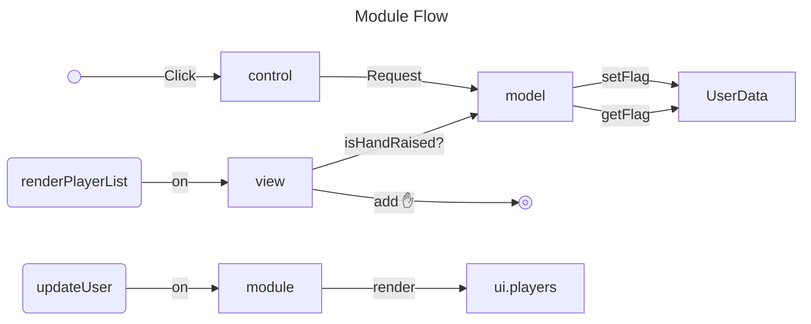

# Raise Your Hand
A simple module for "raising your hand" in FoundryVTT. A button in the scene controls toggles a marker in the player list.

## How it works

This module relies on two hook events:

* **updateUser:** The module stores hand state in the user data, which provides server authority and notification for "free". From this hook, we force the player list to redraw. Many actions can cause a user update, and thus a player list render refresh, but redrawing the panel should not cost a lot.
* **renderPlayerList:** The module prepends a marker (✋) to each player name, according to the flag status.

## Limitations
* The scene control button only appears for non-GM users.
* The scene control button is not automatically sync'd to the hand state in the user data.
* When a user reconnects, their hand state will be reset. When a user disconnects, the hand state will be reset if the GM is still connected.
