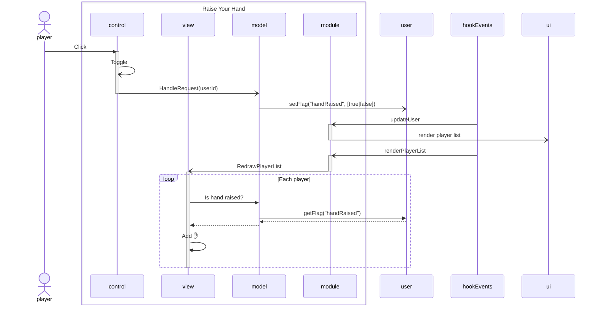

# Raise Your Hand
A simple module for "raising your hand" in FoundryVTT

A button in the scene controls toggles a marker in the player list.

## How it works
This module responds to two hook events:

* **updateUser:** The module stores hand state in the user data, which gets us server authority and notification for "free". From this hook, we force the player list to redraw. This is not ideal, because many actions can cause a user update, but redrawing the panel should not cost a lot.
* **renderPlayerList:** The module prepends a marker (✋) to each player name, according to the flag status.

## Limitations
* The scene control button only appears for non-GM users.
* The scene control button is not automatically sync'd to the hand state in the user data.
* The hand state in the user data is not reset when a user disconnects. It is reset only when a user connects.